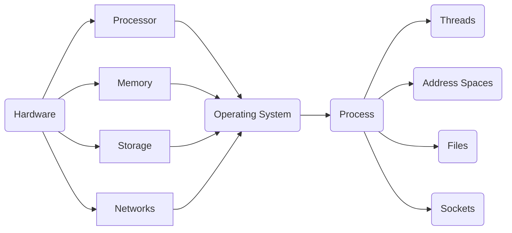
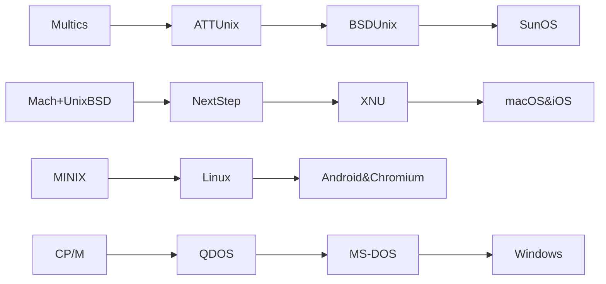

# CS 162: Operating System and System Programming

My Solution About CS162.

# Lab: [pintOS](https://github.com/PeterWrighten/CS162/tree/main/pintOS)

- [ ] [Project 0: PintOS Introduction]()
- [ ] [Project 1: User Program]()
- [ ] [Project 2: Threads]()  
- [ ] [Project 3: File System]()

# HomeWork

- [ ] [HW0: Intro]()
- [ ] [HW1: List]()
- [ ] [HW2: Shell]()
- [ ] [HW3: Scheduling]()
- [ ] [HW4: HTTP Server]()
- [ ] [HW5: Memory]()
- [ ] [HW6: Malloc]()

# Note

## Lecture 1: Overview

**OS Basic: Virtualization to Hardware**

> Provide abstractions to apps

- File Systems
- Processes, threads.
- VM, containers 
- Naming System...

> Manage resources

- Memory, CPU, Storages 

>Achieves the above by implementing specific algos and techniques

- Scheduling 
- Concurrency
- Transactions
- Security

> Compiled Programs' View of World 

- Application's "machine" is the process abstraction provided by the OS
- Each running program runs in its own process 
- Process provide nicer interfaces than raw hardware 

A process consists of:

- Address Space.
- One or more threads of control executing in that address space.
- Additional system state associated with it.

Open files

Open sockets.

> Operating System's View of the World

- OS Translates from hardware interface to application interface.
- OS provides each running program with its own process.

**OS Basics: Switching Process**

- Protection: Segmentation fault(Core dumped)

- OS isolates processes from each other
- isolates itself from other Processes
- even though they are actually running on the same hardware

> Process VMs

Programming simplicity

- Each process thinks it has all memory/CPU time.
- Each process thinks it owns all devices
- Different devices appear to have same high level interface.
- Different interfaces more powerful than raw hardware.

Fault Isolation

- Process unable to directly impact other processes.
- Bugs cannot crash whole machine.

Protection and Portability

- Java interface safe and stable across many platform.

## Lecture 2: Four fundamental concepts

**What is an operating system?**

Special layer of software that provides application software access to hardware resources.

- Convenient abstraction of complex hardware devices.
- Protected access to shared resources
- Security and authentication
- Communication amongst logical entities

**OS Archaeology**

Because of the cost of developing an OS from scratch, most modern OSes have a long lineage.

**Four fundamental concepts**

Thread

- Single unique execution context: fully describes program state.
- Program Counter, Registers, Execution Flags, Stack.

Address Space(with translation)

- Programs execute in an address space that is distinct from the memory space of the physical machine

Process

- An instance of an executing program is a process consisting of an address space and one or more threads of control.

Dual mode operation/Protection

- Only the "system" has the ability to access certain resources.
- The OS and the hardware are protected from user programs and user programs are isolated from one another by controlling the translation from program virtual addresses to machine physical address.

**OS Bottom Line: Run Programs**

- Load instruction and data segments of executable file into memory.
- Create stack and heap.
- "Transfer control to program"
- Provide services to program.
- While protecting OS and program.

