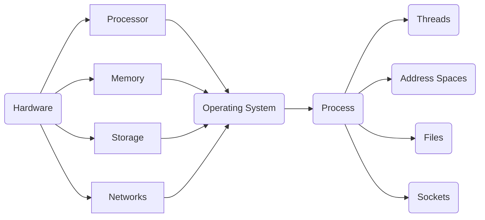

# CS 162: Operating System and System Programming

My Solution About CS162.

# Lab: [pintOS](https://github.com/PeterWrighten/CS162/tree/main/pintOS)

# Note

## Lecture 1

**OS Basic: Virtualization to Hardware**

> Provide abstractions to apps

- File Systems
- Processes, threads.
- VM, containers 
- Naming System...

> Manage resources

- Memory, CPU, Storages 

>Achieves the above by implementing specific algos and techniques

- Scheduling 
- Concurrency
- Transactions
- Security

> Compiled Programs' View of World 

- Application's "machine" is the process abstraction provided by the OS
- Each running program runs in its own process 
- Process provide nicer interfaces than raw hardware 

A process consists of:

- Address Space.
- One or more threads of control executing in that address space.
- Additional system state associated with it.

Open files

Open sockets.

> Operating System's View of the World

- OS Translates from hardware interface to application interface.
- OS provides each running program with its own process.

**OS Basics: Switching Process**

- Protection: Segmentation fault(Core dumped)

- OS isolates processes from each other
- isolates itself from other Processes
- even though they are actually running on the same hardware

> Process VMs

Programming simplicity

- Each process thinks it has all memory/CPU time.
- Each process thinks it owns all devices
- Different devices appear to have same high level interface.
- Different interfaces more powerful than raw hardware.

Fault Isolation

- Process unable to directly impact other processes.
- Bugs cannot crash whole machine.

Protection and Portability

- Java interface safe and stable across many platform.

